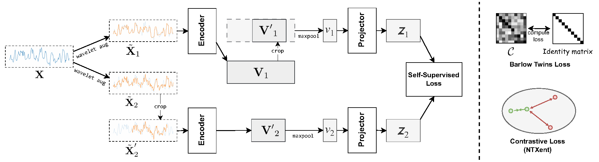

# Self-Supervised Representation Learning for Time Series Classification

  

PyTorch implementation of "Self-Supervised Representation Learning for Time Series Classification".

## Requirements

Experiments were done with Python 3.12.4 with the following libraries:
* numpy==2.2.6
* pandas==2.3.1
* ptwt==1.0.0
* pywavelet==1.9.0
* scikit-learn==1.6.1
* scipy==1.15.3
* torch==2.6.0

## Datasets

The datasets can be obtained from [Series2Vec](https://github.com/Navidfoumani/Series2Vec). Create a `datasets/` folder then move the data into the folder.

## Acknowledgement
Our code are based on the following repositories.
1. [BarlowTwins](https://github.com/facebookresearch/barlowtwins)
2. [T-Loss](https://github.com/White-Link/UnsupervisedScalableRepresentationLearningTimeSeries)
3. [TS2Vec](https://github.com/zhihanyue/ts2vec)
4. [UvA DL Notebooks - Tutorial 17: Self-Supervised Contrastive Learning with SimCLR](https://uvadlc-notebooks.readthedocs.io/en/latest/tutorial_notebooks/tutorial17/SimCLR.html)
